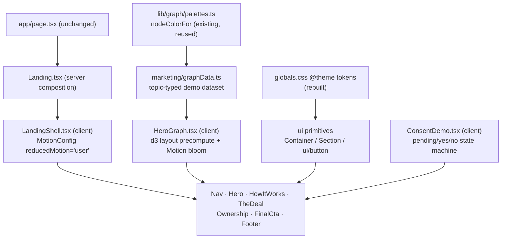

# Landing Page — Fresh Build Plan (refined)

## Context
The session-16 landing page (`apps/web/components/marketing/`, 11 files, ~1240 lines) is being replaced, not polished. Goal: a marketing page that sells Hype's core loop (talk → graph grows) and the consent-ads model honestly, converts to `/signup`, and is ready for Vercel. Constraints: design tokens only, motion via `motion/react`, shadcn/ui for base components, transform/opacity-only animation, `prefers-reduced-motion` respected, mobile-first, Lighthouse ≥95.

Verified against the repo:
- `app/page.tsx` already renders `<Landing />` with the logged-in → `/graph` redirect — **untouched**.
- Tailwind v4 CSS-first (`@tailwindcss/postcss`, no tailwind.config); tokens live in `app/globals.css`.
- Fonts already wired in `app/layout.tsx` (Bricolage/Hanken/Space Mono via `next/font` variables) with the `.landing` scope override in globals.css — **keep both as-is**.
- No shadcn yet (no `components.json`); `@/*` path alias exists; React 19 + Tailwind v4 are supported by current shadcn CLI.
- `d3` is already a dependency (app graph screen); `lib/graph/palettes.ts` exports client-safe `nodeColorFor(topic, mode)` — the real product palette.

## Decisions (draft confirmed + refinements)

1. **Stay in Next.js App Router** — page is static-prerendered, redirect logic stays, no second app.
2. **Dark-only** — `ThemeToggle.tsx` and all `light:` variants/`@custom-variant light` CSS die with the old page.
3. **Primary CTA**: "Start your graph" → `/signup`, appearing in Nav, Hero, Final CTA. Only CTA on the page.
4. **Hero graph — refinement over the draft**: don't hand-author a new SVG. Keep the demo *dataset* idea but rebuild `graphData.ts` so each node carries a `topic` and gets its color from `nodeColorFor(topic, "vibrant")` (`lib/graph/palettes.ts`) — landing and product share one palette, zero hex in marketing. The renderer (`HeroGraph.tsx`) runs `d3.forceSimulation(...).tick(300)` **synchronously on mount** to get final positions (no per-frame D3 DOM writes), renders plain React SVG, and animates the bloom with Motion: stagger delay = BFS depth from the "you" node × step, scale/opacity only. Ambient float = one slow Motion `y` loop on the group. This replaces the old `DemoGraph.tsx` (which animates `r` via D3 transitions — violates the transform/opacity rule).
5. **shadcn**: `pnpm dlx shadcn@latest init` in `apps/web` (creates `components.json`, `lib/utils.ts` with `cn`, adds `class-variance-authority`/`clsx`/`tailwind-merge`), then `add button` only. Let it live at the standard `components/ui/button.tsx` (reusable app-wide later); restyle its variants to tokens — `primary` and `ghost` only.
6. **Footer links**: "Sign in" → `/login` (real). Privacy stays an `#` placeholder — real privacy/legal copy is already tracked as pre-deploy blocker #2 in CLAUDE.md, out of scope here. **Cut the GitHub link** (repo is private; consumer product).

## Structure

`Landing.tsx` stays a server component; `LandingShell` is the one client wrapper providing `MotionConfig reducedMotion="user"` (global reduced-motion enforcement — Motion nulls transform/opacity animations for those users automatically). Static sections passed as children keep prerendering.

## 1. Token layer — `app/globals.css` surgery

**Delete** (all only used by the old landing; verified no usage elsewhere — ChatPanel/route.ts grep hits were comments):
- Landing color tokens inside `@theme inline` (`--color-void/mist/edge/ask/you-*`, lines ~18–29)
- All landing motion CSS: `.reveal`, `hype-float`, `hero-in`, `graph-ink`/`amber-ink`, `offer-in`, Thread keyframes, `node-bud` (lines ~49–199 incl. the `prefers-reduced-motion` block for those classes)
- Light theme: `@custom-variant light`, `[data-theme="light"]` blocks, and all `--g-*` graph vars (lines ~114–151)

**Keep**: `@import "tailwindcss"`, base `:root`/dark-scheme/body, the `@theme inline` font vars, and the `.landing` font-scope block (lines ~32–47).

**Add** a new `@theme` block:
- Colors (shadcn-compatible names so Button inherits): `--color-background` (near-black, match app's `#0d0d0d` family), `--color-surface`, `--color-border`, `--color-foreground`, `--color-muted-foreground`, `--color-primary` + `--color-primary-foreground`, `--color-ask` (amber — reserved for the consent ask only), `--color-node-green/blue/purple/pink`.
- Fluid type: `--text-display/title/lead/body/label` as `clamp()` values (Tailwind v4 emits `text-display` utilities from these).
- `--spacing-section` (clamp ~4rem→8rem), `--radius-sm/md/lg`, `--shadow-panel`, `--shadow-glow`.

## 2. Files

**Delete** all 11 old files in `components/marketing/`: `Landing.tsx`, `Nav.tsx`, `DemoGraph.tsx`, `graphData.ts`, `Reveal.tsx`, `ConsentPanel.tsx`, `TalkDemo.tsx`, `GrowthTimeline.tsx`, `Thread.tsx`, `PhoneMock.tsx`, `ThemeToggle.tsx`.

**Create** in `components/marketing/`:
| File | Role |
|---|---|
| `Landing.tsx` | Server composition: Nav → Hero → HowItWorks → TheDeal → Ownership → FinalCta → Footer inside `LandingShell`; root `
` keeps the font scope |
| `LandingShell.tsx` | Client; `MotionConfig reducedMotion="user"` |
| `ui/Container.tsx`, `ui/Section.tsx` | Primitives: max-width+padding; vertical rhythm + mono kicker + heading slot |
| `Nav.tsx` | Sticky, hairline border, wordmark + CTA button |
| `Hero.tsx` + `HeroGraph.tsx` | Headline/subline/CTA over the bloom (HeroGraph client, decision #4) |
| `graphData.ts` | Demo dataset, nodes typed `{id, label, topic, hub?, depth-derived}`; colors via `nodeColorFor` |
| `HowItWorks.tsx` | 3 quiet steps: you talk → a node appears → the graph compounds |
| `TheDeal.tsx` + `ConsentDemo.tsx` | "Finds, not a fee" section; ConsentDemo = interactive pending/yes/no state machine (port the old `ConsentPanel.tsx` copy + state logic — it's good — restyled to tokens, Motion `AnimatePresence` for card slide-in, in-view triggered, replayable) |
| `Ownership.tsx` | "It's yours": Obsidian-compatible markdown vault, export anytime, delete anytime |
| `FinalCta.tsx` | One line + CTA |
| `Footer.tsx` | Wordmark, Sign in, Privacy placeholder |
| `Reveal.tsx` | Shared client fade-up: `motion.div` `whileInView` once, ~0.5s, translate/opacity |

Copy positioning: *"An AI that actually remembers you — every conversation grows a living knowledge graph of who you are. Free, because you choose the ads: finds you ask for, never a feed."* Salvage the strongest old lines where they fit (ConsentDemo dialogue, "Free forever · You see everything it knows · Delete it all, anytime").

**Cut** (per draft): testimonials, pricing table, feature grid, FAQ, logo wall, newsletter, GrowthTimeline (its point folds into HowItWorks step 3), Thread scroll spine, phone mock, light theme.

## 3. Build order
1. `pnpm add motion` (in `apps/web`) + shadcn init + `add button`.
2. Delete the 11 old files; do the globals.css surgery (delete + new `@theme`). `pnpm build` must pass here — proves nothing outside marketing depended on the deleted CSS.
3. Primitives (`Container`, `Section`, restyled `ui/button`).
4. `graphData.ts` + sections 1→7 static (no motion yet), composed in `Landing.tsx`. Build check.
5. Signature motion: `HeroGraph` bloom, `ConsentDemo` transitions, `Reveal` wiring, `LandingShell` MotionConfig.

## 4. Verification
- `cd apps/web && pnpm build` — clean static prerender of `/` (and after step 2, mid-build).
- `pnpm dev` walkthrough at 375px and 1440px: all sections render, no horizontal scroll, all three CTAs → `/signup`, footer Sign in → `/login`, ConsentDemo yes/no/replay paths work.
- DevTools → emulate `prefers-reduced-motion: reduce` → hero renders fully-formed, ConsentDemo switches states without transitions, no reveals move.
- Grep gate: no hex literals and no arbitrary `[...]` values in `components/marketing/` (colors come from tokens + `nodeColorFor`).
- Logged-in redirect still works (visit `/` with a session → `/graph`).
- Lighthouse on `pnpm build && pnpm start` — performance ≥95.

Out of scope (tracked elsewhere in CLAUDE.md): actual Vercel deploy (blocked on GDPR delete-account + legal copy), real privacy page.
